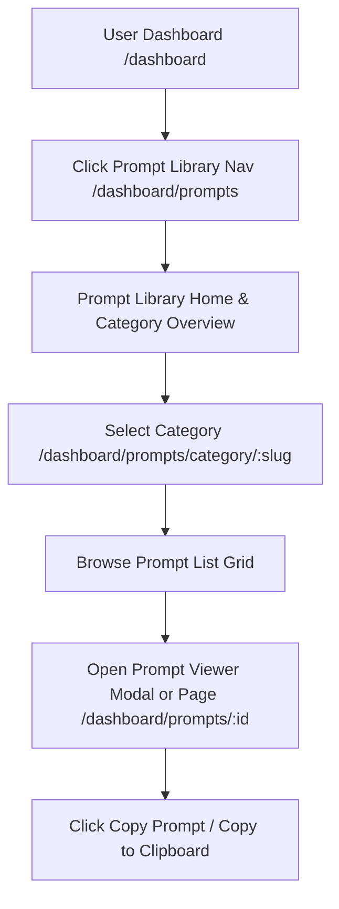
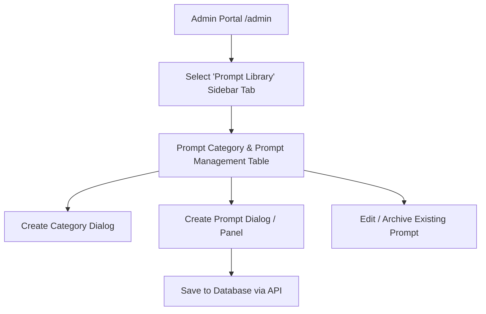

# Prompt Library Architecture & Implementation Plan
**Project:** Future with AI  
**Version:** 1.0.0  
**Status:** Architecture & Foundation Phase (Non-destructive / Specification)

---

## 1. Feature Goals

The **Prompt Library** is a dedicated feature designed to curate, organize, and serve high-utility AI prompts across diverse domains (e.g., Coding, Marketing, Writing, Data Science, Image Generation, Productivity).

### Target Capabilities
* **For Admins:**
  * Categorize prompts into logical topics (e.g., *Frontend Engineering*, *Copywriting*, *Data Analysis*).
  * Create, edit, and archive prompt templates with variables/placeholders.
  * Tag prompts with target LLMs (ChatGPT, Claude, Midjourney, DeepSeek), difficulty, and tags.
  * Monitor prompt copy count and utility metrics.

* **For Users / Learners:**
  * Discover prompts via intuitive category cards and dynamic search/filter controls.
  * Preview full prompt content, system instructions, and sample input/output.
  * Instantly copy ready-to-use prompts with 1-click clipboard integration.
  * Filter prompts by category, AI model compatibility, and complexity level.

---

## 2. User Flow



1. **Dashboard Entry Point:** User navigates to `/dashboard/prompts` via the top navigation bar (`DashboardNavbar.tsx`).
2. **Category Overview:** User views featured categories, popular prompts, and search bar.
3. **Category Selection:** Clicking a category card filters the list or opens the category detail page `/dashboard/prompts/category/[slug]`.
4. **Prompt Inspection:** Clicking a prompt card opens a full `PromptViewer` modal or detailed view showcasing variables, description, and usage tips.
5. **Action:** User clicks `CopyButton` to copy the formatted prompt directly to clipboard with visual toast/badge feedback.

---

## 3. Admin Flow



1. **Admin Sidebar Entry:** Admin accesses `/admin` and selects the `Prompt Library` tab in `AdminSidebar.tsx`.
2. **Management Dashboard:** Displays top-level stats (Total Prompts, Categories, Total Copies) alongside dual tables for **Categories** and **Prompts**.
3. **Category Management:** Create new categories with title, description, icon name, and color theme.
4. **Prompt Management:** Rich form modal to define title, category, target model, system prompt text, user prompt template, variables, tags, and active status.
5. **Publish/Edit:** Real-time updates with immediate reflection on user-facing dashboard.

---

## 4. Required Pages & Route Architecture

### User Dashboard Routes
| Route | Type | Description |
| :--- | :--- | :--- |
| `/dashboard/prompts` | Server/Client Component | Main Prompt Library hub with featured categories, search, and prompt grid |
| `/dashboard/prompts/category/[slug]` | Server/Client Component | Category-filtered prompt view with specific tags and sorting |
| `/dashboard/prompts/[id]` | Server/Client Component | Direct detail view for individual prompts (SEO-friendly / shareable) |

### Admin Dashboard Routes / Sub-views
| Route / View | Component | Description |
| :--- | :--- | :--- |
| `/admin` (Tab: `prompts`) | `AdminPromptsSection.tsx` | Main admin panel for categories and prompt CRUD management |
| `/admin` (Tab: `prompt-categories`) | `AdminPromptCategoriesSection.tsx` | Category configuration and ordering panel |

---

## 5. Recommended Database Design (Prisma Schema Extensions)

*Note: Schema proposal only — no modifications executed in this phase.*

```prisma
// ==========================================
// PROMPT LIBRARY MODELS
// ==========================================

model PromptCategory {
  id          String   @id @default(cuid())
  name        String   @unique
  slug        String   @unique
  description String?
  icon        String   @default("Sparkles") // Lucide icon identifier
  color       String   @default("#8B7FE8")  // Theme accent color
  bgLight     String   @default("#F3F0FE")  // Light background highlight
  order       Int      @default(0)
  isPublished Boolean  @default(true)
  prompts     Prompt[]
  createdAt   DateTime @default(now())
  updatedAt   DateTime @updatedAt

  @@index([slug])
}

model Prompt {
  id          String   @id @default(cuid())
  title       String
  slug        String   @unique
  description String   @db.Text
  systemPrompt String? @db.Text              // System instruction context
  template    String   @db.Text              // Actual prompt text with {{placeholders}}
  targetModel String   @default("ChatGPT")   // ChatGPT, Claude, Midjourney, etc.
  difficulty  String   @default("Beginner")  // Beginner, Intermediate, Advanced
  tags        String[]                       // Array of tag keywords
  copyCount   Int      @default(0)           // Utility tracking counter
  isFeatured  Boolean  @default(false)
  isPublished Boolean  @default(true)
  
  categoryId  String
  category    PromptCategory @relation(fields: [categoryId], references: [id], onDelete: Cascade)
  
  createdAt   DateTime @default(now())
  updatedAt   DateTime @updatedAt

  @@index([categoryId])
  @@index([slug])
  @@index([isPublished, isFeatured])
}
```

---

## 6. Recommended API Endpoints

### Public / User Endpoints
* **`GET /api/prompts/categories`**
  * Fetches published prompt categories sorted by display order.
* **`GET /api/prompts`**
  * Query parameters: `category`, `search`, `model`, `difficulty`, `page`, `limit`.
  * Returns paginated list of public prompts.
* **`GET /api/prompts/[id]`**
  * Fetches single prompt details.
* **`POST /api/prompts/[id]/copy`**
  * Increments `copyCount` metric asynchronously when user copies prompt.

### Admin-Only Endpoints (Protected via `future_ai_admin_session` cookie / RBAC)
* **`POST /api/admin/prompt-categories`** — Create category
* **`PUT /api/admin/prompt-categories/[id]`** — Update category
* **`DELETE /api/admin/prompt-categories/[id]`** — Delete category
* **`POST /api/admin/prompts`** — Create prompt
* **`PUT /api/admin/prompts/[id]`** — Update prompt
* **`DELETE /api/admin/prompts/[id]`** — Delete prompt

---

## 7. Recommended Component Structure

```
src/
├── components/
│   ├── prompts/                      # Prompt Library components
│   │   ├── CategoryCard.tsx          # Card displaying category icon, title, count & color theme
│   │   ├── PromptCard.tsx            # Card displaying prompt title, model badge, description, copy btn
│   │   ├── PromptViewerModal.tsx     # Detailed dialog viewing prompt system context & variables
│   │   ├── CopyButton.tsx            # Interactive clip-copy button with GSAP micro-animation
│   │   ├── PromptFilterBar.tsx       # Search input + model dropdown + difficulty pills
│   │   └── PromptGrid.tsx            # Responsive grid container for prompt cards
│   │
│   └── admin/
│       └── sections/
│           ├── AdminPromptsSection.tsx           # Admin prompts datatable + CRUD forms
│           └── AdminPromptCategoriesSection.tsx  # Admin categories datatable + modal
```

---

## 8. Navigation Integration Plan

To seamlessly integrate the Prompt Library into the existing user and admin experiences:

### 1. User Navigation Integration
* **File to Modify:** `src/components/DashboardNavbar.tsx` (Lines 55–62)
* **Exact Change:** Add `{ name: "Prompt Library", href: "/dashboard/prompts", icon: FolderSparkles }` (or `Sparkles` / `Terminal` from `lucide-react`) to `navLinks` array.

### 2. Admin Navigation Integration
* **File to Modify:** `src/components/admin/AdminSidebar.tsx` (Lines 28–45 & 60–78)
* **Exact Change:**
  1. Add `"prompts"` to `AdminTab` type union.
  2. Add `{ id: "prompts", label: "Prompt Library", icon: FolderSparkles, badge: "New", badgeColor: "bg-[#F5F2FF] text-[#8B7FE8]" }` to `MENU_ITEMS`.
* **File to Modify:** `src/app/admin/page.tsx` (Lines 57–78)
* **Exact Change:** Add case for `"prompts"` in `renderActiveSection()` returning `<AdminPromptsSection />`.

---

## 9. Future Files Creation Checklist

When implementation begins, the following files will be created:

1. `src/app/dashboard/prompts/page.tsx`
2. `src/app/dashboard/prompts/category/[slug]/page.tsx`
3. `src/app/dashboard/prompts/[id]/page.tsx`
4. `src/components/prompts/CategoryCard.tsx`
5. `src/components/prompts/PromptCard.tsx`
6. `src/components/prompts/PromptViewerModal.tsx`
7. `src/components/prompts/CopyButton.tsx`
8. `src/components/prompts/PromptFilterBar.tsx`
9. `src/components/admin/sections/AdminPromptsSection.tsx`
10. `src/app/api/prompts/route.ts`
11. `src/app/api/prompts/categories/route.ts`
12. `src/app/api/admin/prompts/route.ts`
13. `src/app/api/admin/prompt-categories/route.ts`

---

## 10. Risk Analysis & Compatibility Verification

| Identified Area | Current State | Compatibility & Risk Mitigation |
| :--- | :--- | :--- |
| **Authentication & Middleware** | Double layer: NextAuth JWT for users + Cookie `future_ai_admin_session` for Admin. | High compatibility. Prompt endpoints will follow existing NextAuth session / Admin cookie check patterns cleanly. |
| **Styling & Design System** | Custom CSS variables in `globals.css` with soft ambient themes (`#8B7FE8`, `#FAFAFF`, glassmorphism cards). | Zero risk. Component design will reuse `Card`, `Button`, `Badge` and existing CSS token system. |
| **Database Migrations** | Prisma 6.19.3 configured with PostgreSQL (`prisma/schema.prisma`). | Low risk. Adding `PromptCategory` and `Prompt` models will strictly be additive without altering `User`, `Account`, or `Session`. |
| **State & Interactivity** | Client state management via React Hooks + GSAP animations for buttons. | High compatibility. UI components will leverage existing `cva` button variants and GSAP spring animations. |
